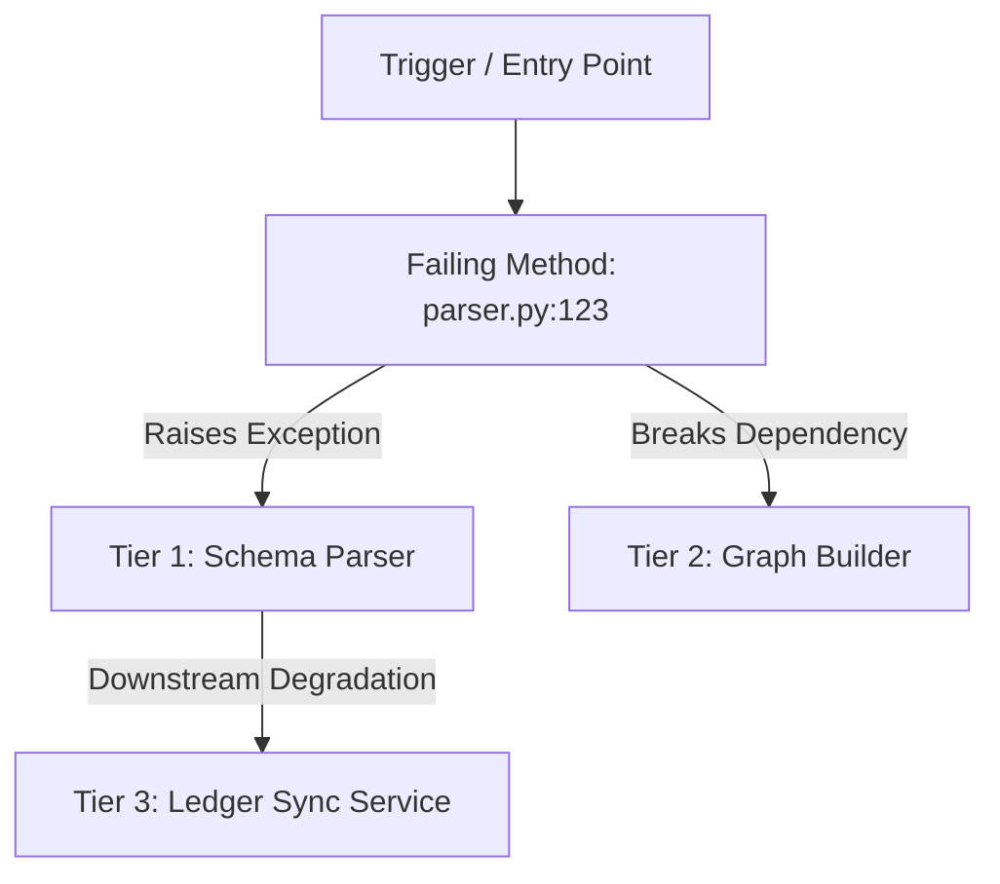

# Entigram Incident Response & Triage Skill (`entigram-incident`)

## Overview

`entigram-incident` is a **local multi-agent incident triage and response skill** for Entigram applications, compilers, schemas, and runtime services.

When an operational failure, runtime crash, stack traceback, or bug occurs, this skill launches 5 specialized subagents in parallel to perform deep diagnostic analysis, trace module and schema blast radius, propose safety-ranked code fixes, evaluate rollback vs. forward-fix safety, and draft audience-tailored stakeholder communications.

This skill operates **strictly locally within your workspace**. It does NOT make remote git calls, push branches, or post PRs or messages to external platforms (Slack/GitHub/Jira). All diagnostics, fix options, diagrams, and communication drafts are output into a structured local artifact (`incident_report.md`).

---

## When to Use & Triggers

### Triggers & Example Prompts
Activate this skill whenever an error, bug, failure, or outage is reported:
- *"Debug this exception traceback: [paste traceback]"*
- *"Triage incident: Entigram LDS schema compiler throwing AttributeError in parser.py"*
- *"Analyze failing logs and propose a hotfix for module X"*
- *"Run incident response for error: SPARQLQuerySyntaxError in ontology compiler"*
- *"Assess whether we should roll back or forward-fix after failing deployment"*

---

## The 5 Parallel Subagents

| Agent Name | Primary Focus Area | Key Outputs | Reference Checklist |
|------------|-------------------|-------------|---------------------|
| **log-analyzer** | Error Log & Traceback Analysis | Deconstructed traceback, error pattern classification, root cause analysis (RCA), and failing stack frame identification. | [log-analyzer.md](references/log-analyzer.md) |
| **blast-radius** | Dependency & Schema Impact Tracing | Affected components (Tier 1–3), LDS schema & TTL ontology coupling, call-graph analysis, and Mermaid blast radius flowchart. | [blast-radius.md](references/blast-radius.md) |
| **fix-proposer** | Code Fix Synthesis & Safety Ranking | Safety-ranked fix options (hotfix vs. structural fix), confidence scores (0–100%), concrete code diffs, and verification steps. | [fix-proposer.md](references/fix-proposer.md) |
| **rollback-assessor** | Change Recency & Rollback Safety | Commit recency inspection, database/schema migration dependency evaluation, rollback vs. forward-fix decision matrix, and rollback steps. | [rollback-assessor.md](references/rollback-assessor.md) |
| **communication-drafter** | Stakeholder Communication & Timeline | Chronological incident timeline, technical briefing for devs, executive summary for stakeholders, and public/internal status updates. | [communication-drafter.md](references/communication-drafter.md) |

---

## Workflow Execution

### Step 1: Capture Incident Context & Input Details
Gather all available details from the user prompt or log outputs:
- **Error Input**: Traceback, exception message, diagnostic logs, or symptom description.
- **Scope & Affected Files**: Source code files (`.py`, `.ts`), schema definitions (`.lds`), ontology models (`.ttl`), or configuration files mentioned.
- **Environment Context**: Target workspace module, test file, or runtime script.

If minimal context is provided, prompt for logs or inspect recent workspace changes to infer context.

---

### Step 2: Launch 5 Subagents in Parallel

Invoke all 5 subagents concurrently using `invoke_subagent` with the `research` subagent type. Pass the error context and reference checklists:

```markdown
Launch 5 agents via invoke_subagent (type: research):
- Subagent 1: log-analyzer (referencing references/log-analyzer.md)
- Subagent 2: blast-radius (referencing references/blast-radius.md)
- Subagent 3: fix-proposer (referencing references/fix-proposer.md)
- Subagent 4: rollback-assessor (referencing references/rollback-assessor.md)
- Subagent 5: communication-drafter (referencing references/communication-drafter.md)
```

---

### Step 3: Subagent Deep-Dive & Output Requirements

#### 1. `log-analyzer` Output
- Extract exact error type, message, and failing line (`file.py:line`).
- Parse the stack trace frame by frame from entry point to failure site.
- Categorize the error pattern (e.g. Data Contract Mismatch, Null Reference, Type Error, Concurrency/Lock).
- Formulate a precise Root Cause Analysis (RCA) hypothesis explaining *why* the code failed.

#### 2. `blast-radius` Output
- Identify Tier 1 direct impact (failing file/method), Tier 2 secondary callers/dependencies, Tier 3 indirect consumer impacts.
- Audit LDS schema (`*.lds`) and TTL ontology (`*.ttl`) references to assess schema coupling.
- Generate a Mermaid dependency & failure propagation flowchart (`graph TD`).

#### 3. `fix-proposer` Output
- Generate at least two distinct fix strategies:
  - **Option A (Minimal Immediate Hotfix)**: Fast defensive patch / guardrail.
  - **Option B (Comprehensive Structural Fix)**: Root-cause remediation without tech debt.
- Assign confidence scores (0–100%) and safety ratings (High / Medium / Low).
- Provide concrete unified code diffs (`diff` / code snippets) and exact verification test commands.

#### 4. `rollback-assessor` Output
- Inspect change recency (e.g., git commit history or file modification timestamps).
- Evaluate schema/database migration state changes (e.g., SQLite ledger alterations or ontology changes).
- Compute Rollback vs. Forward-Fix Safety Matrix (Recommend Rollback vs. Forward-Fix).
- Provide step-by-step local rollback execution steps and verification checks.

#### 5. `communication-drafter` Output
- Build incident timeline (Detection -> Triage -> RCA -> Fix Plan -> Resolution).
- Draft tailored communications:
  - **Engineering Briefing**: Technical depth, exact files, stack frame reference, unit test verification.
  - **Executive Summary**: Non-technical overview, business/operational impact, ETR.
  - **Status Update**: Concise public/internal status statement.

---

### Step 4: Consolidate Findings into Incident Report Artifact

Synthesize all 5 subagent outputs into a structured artifact file named `incident_report.md` in the brain artifacts directory (`<appDataDir>/brain/<conversation-id>/incident_report.md`).

#### Artifact Template (`incident_report.md`)

```markdown
# 🚨 Entigram Incident Report & Triage Summary

## 📌 Executive Summary
- **Incident Title**: [Short Title of Issue]
- **Severity**: 🔴 P0 - Critical Outage | 🟠 P1 - Major Degradation | 🟡 P2 - Minor Defect
- **Failing Component**: `path/to/failing_file.py:L123`
- **Primary Exception**: `ExceptionName: Error message string`
- **Recommended Action**: Forward-Fix (Option A) / Rollback

---

## 🔍 1. Root Cause Analysis (log-analyzer)
- **Error Pattern**: [e.g., Null Reference Dereference / LDS Schema Contract Violation]
- **Failing Stack Frame**: `file.py:L123` in `method_name()`
- **Detailed Mechanism**:
  [Detailed description of what state led to the exception]
- **Deconstructed Traceback**:
  ```text
  Traceback line 1
  Traceback line 2
  ...
  ```

---

## 💥 2. Blast Radius Analysis & Dependency Topology (blast-radius)

### Affected Modules & Schemas
- **Tier 1 (Direct Failure)**: `entigram/schema_compiler/parser.py`
- **Tier 2 (Secondary Callers)**: `entigram/schema_compiler/compiler.py`, `entigram/graph_builder/builder.py`
- **Schema & TTL Coupling**: `schema.lds`, `ontology.ttl`

### Blast Radius Flowchart


---

## 🛠️ 3. Fix Options & Safety Rankings (fix-proposer)

| Option | Fix Type | Confidence | Safety | Blast Radius Risk | Recommendation |
|--------|----------|------------|--------|-------------------|----------------|
| **Option A** | Defensive Hotfix | 90% | High | Low | 🌟 Recommended Immediate |
| **Option B** | Structural Refactor | 75% | Medium | Medium | Post-Incident Follow-up |

### Option A: Defensive Hotfix (Recommended)
- **Strategy**: Add defensive guardrail and null check prior to attribute access.
- **Confidence Score**: 90% (Low risk of regression, addresses primary crash site).

#### Code Diff:
```diff
--- a/entigram/schema_compiler/parser.py
+++ b/entigram/schema_compiler/parser.py
@@ -120,5 +120,7 @@ def parse_entity(raw_ast):
-    entity_id = raw_ast['id']
+    entity_id = raw_ast.get('id') if raw_ast else None
+    if not entity_id:
+        logger.warning("Empty entity AST received, returning fallback")
+        return None
```

- **Verification Command**:
  ```bash
  pytest tests/test_schema_parser.py -k test_parse_entity
  ```

---

## 🔄 4. Rollback vs. Forward-Fix Assessment (rollback-assessor)

- **Rollback Recommendation**: ❌ **NOT RECOMMENDED** (Forward-Fix is safer)
- **Recency Analysis**: Failing code was introduced 12 commits ago; rollback would revert 4 unrelated valid features.
- **Schema & Data Migration Risk**: Low (no destructive LDS/TTL schema migrations involved).
- **Comparison Matrix**:
  - **Forward-Fix TTR**: ~10 minutes (Patch diff option A)
  - **Rollback TTR**: ~30 minutes (Reverting multiple commits and re-running full suite)

---

## 📢 5. Stakeholder Communication Drafts (communication-drafter)

### 🔧 Engineering Briefing
> **Incident**: `AttributeError` in `SchemaParser.parse_entity`  
> **Root Cause**: Unhandled missing key `'id'` when parsing dynamic entity AST.  
> **Fix**: Applying defensive check patch (`Option A`).  
> **Verification**: `pytest tests/test_schema_parser.py`.

### 📊 Executive Summary
> **Status**: Fix Identified & Under Testing  
> **Impact**: Schema parsing failed for legacy AST payloads, causing temporary ingestion stalls.  
> **ETR**: 15 minutes. No data loss occurred.

### 📢 Status Page Notice
> **Investigating**: We have identified the root cause affecting LDS schema parsing. A fix is being applied and verified. Further updates will be provided shortly.
```

---

### Step 5: Present Summary to User

After generating the artifact:
1. Present a clear, high-level summary in the main chat response highlighting:
   - Identified Root Cause
   - Selected Fix Option & Confidence Score
   - Rollback Recommendation Summary
2. Provide a clickable link to the generated local artifact file (`incident_report.md`).

---

## Local-Only Policy

- ❌ Do NOT execute `git push`, `git commit`, or remote repository mutations automatically.
- ❌ Do NOT open Pull Requests, GitHub issues, or Slack messages.
- ❌ Do NOT invoke remote webhooks or external API reporting tools.
- ✅ Keep all diagnostics, fix proposals, diagrams, and communication drafts strictly local in artifact files.
