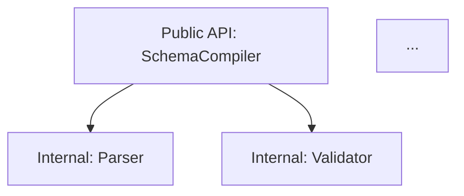

# Entigram Multi-Agent Refactoring Analysis

## Overview

A **local workspace refactoring analysis tool** that launches 5 specialized agents in parallel to analyze target code modules, map dependencies, identify tight coupling and code smells, plan function/class extractions with concrete before/after examples, assess test impact, and recommend clearer naming.

This skill produces a **local refactoring plan artifact** (`refactoring_plan.md`). It operates entirely within your local workspace — it does NOT perform git commits, open PRs, or interact with external services.

## When to Use

- "Refactor this module" / "Suggest refactorings for directory X"
- "Analyze coupling and dependencies in module Y"
- "Help me clean up / decompose this God class"
- "Plan a refactoring for target path Z"
- Pre-refactoring assessment before major feature development

## The 5 Specialized Agents

| Agent | Focus Area | Reference Checklist |
|-------|-----------|---------------------|
| **dependency-mapper** | Import/Call Graphs, Entry Points, Module Boundaries | [dependency-mapper.md](references/dependency-mapper.md) |
| **coupling-analyzer** | Tight Coupling, Circular Dependencies, God Classes, SRP Violations | [coupling-analyzer.md](references/coupling-analyzer.md) |
| **extraction-planner** | Function/Class Extractions, Design Patterns, Before/After Examples | [extraction-planner.md](references/extraction-planner.md) |
| **test-impact-analyzer** | Test Mapping, Broken Test Risk, Pre-refactoring Test Requirements | [test-impact-analyzer.md](references/test-impact-analyzer.md) |
| **naming-reviewer** | Symbol Clarity, Domain Alignment, Anti-Pattern Name Refactorings | [naming-reviewer.md](references/naming-reviewer.md) |

## Workflow

### 1. Determine Scope & Target Module

Identify the target module or directory specified by the user:
- **Specific File/Module:** E.g., `entigram/schema_compiler/parser.py`
- **Subdirectory/Package:** E.g., `entigram/ontology_compiler/`
- **Feature Area:** E.g., `src/assessment/`

If the user does not specify a target, ask for clarification or infer from recent work context.

### 2. Launch 5 Agents in Parallel

Use `invoke_subagent` with the `research` type to launch all 5 agents concurrently. Each subagent receives:
- Target file/directory path(s)
- Instructions to inspect source code directly
- Relevant checklist reference from `references/`
- Standardized output prompt instructions

```markdown
Launch 5 agents via invoke_subagent:
- agent 1: dependency-mapper
- agent 2: coupling-analyzer
- agent 3: extraction-planner
- agent 4: test-impact-analyzer
- agent 5: naming-reviewer
```

### 3. Agent Reporting Formats

Each agent reports findings structured according to its focus area:

#### 1. dependency-mapper Output
- Public API entry points & internal helper functions
- Inbound/outbound module dependencies
- Mermaid dependency flowcharts (`graph TD`)
- High fan-in / high fan-out module alerts

#### 2. coupling-analyzer Output
- Identified circular dependencies
- God classes (>500 lines or >10 public responsibilities)
- SRP violations & feature envy instances
- Severity rating (P0 Critical circularities to P3 Low minor parameter coupling)

#### 3. extraction-planner Output
- Specific extraction opportunities (Extract Function, Extract Class, Strategy Pattern)
- Rationale and structural benefits
- Concrete **Before** and **After** code snippets
- Target target file locations for extracted components

#### 4. test-impact-analyzer Output
- Existing test suites covering target module
- Test suites requiring updates due to signature or structural changes
- Missing test coverage areas (tests needed *before* refactoring)
- Step-by-step test execution and verification plan

#### 5. naming-reviewer Output
- Anti-pattern names detected (`data`, `temp`, `process`, deceptive names)
- Table of Current Symbol vs. Proposed Refactored Symbol
- Domain-aligned naming recommendations and rationale

### 4. Consolidate & Rank Suggestions

Once all 5 agents finish execution:
1. Matrix-rank all proposed refactorings using **Impact vs. Effort**:
   - **⚡ Quick Wins** (High Impact, Low Effort): High payoff, low risk (e.g. naming fixes, small method extractions).
   - **🎯 Major Structural Improvements** (High Impact, High Effort): Architectural decompositions (e.g. splitting God class, breaking circular dependencies).
   - **🧹 Low-Hanging Fruit** (Low Impact, Low Effort): Minor cleanups, constant extractions.
   - **⏳ Deprioritized / High Effort** (Low Impact, High Effort): Complex changes with marginal readability gains.
2. Link extractions to test impact assessments and dependency topology changes.

### 5. Generate Refactoring Plan Artifact

Write a comprehensive artifact file `refactoring_plan.md` in the brain artifacts directory (`<appDataDir>/brain/<conversation-id>/refactoring_plan.md`):

```markdown
# Refactoring Plan: [Target Module Name]

## Executive Summary
- Target Scope: `path/to/target`
- Key Architecture Observations
- Refactoring Metrics Summary (Extractions, Coupling Fixes, Naming Cleanups, Test Impact)

## Refactoring Matrix (Impact vs Effort)
| Priority | Category | Refactoring Suggestion | Impact | Effort | Affected Files |
|----------|----------|------------------------|--------|--------|----------------|
| P1 | Quick Win | Rename `proc()` to `parse_schema_definition()` | High | Low | `parser.py` |
| P1 | Structural | Extract `ValidationEngine` from `SchemaCompiler` | High | High | `compiler.py` |

## 1. Dependency Topology & Architecture Graph


## 2. Coupling & Code Smell Analysis
- **Circular Dependencies**: ...
- **God Classes / Files**: ...
- **SRP Violations**: ...

## 3. Extraction Proposals (Before / After Examples)
### Extraction 1: [Name]
- **Target File**: `path/to/new_or_existing_file.py`
- **Impact / Effort**: High / Medium
- **Rationale**: ...

#### Before:
```python
# original code
```

#### After:
```python
# refactored code
```

## 4. Naming & Clarity Improvements
| Current Symbol | Proposed Symbol | Location | Rationale |
|----------------|-----------------|----------|-----------|
| `data` | `parsed_entity_ast` | `parser.py:45` | Reflects AST structure |

## 5. Test Impact & Safety Plan
- **Tests Needing Updates**: `tests/test_parser.py`
- **Missing Coverage Before Refactoring**: ...
- **Verification Commands**: `pytest tests/unit/`
```

### 6. Present Summary to User

Provide a brief summary in the chat highlighting top quick wins and major structural recommendations, referencing the generated artifact `refactoring_plan.md`.

## Local-Only Guarantee

- ❌ No git commits or branches created automatically
- ❌ No PR creation or GitHub API interaction
- ❌ No remote API calls outside local subagents
