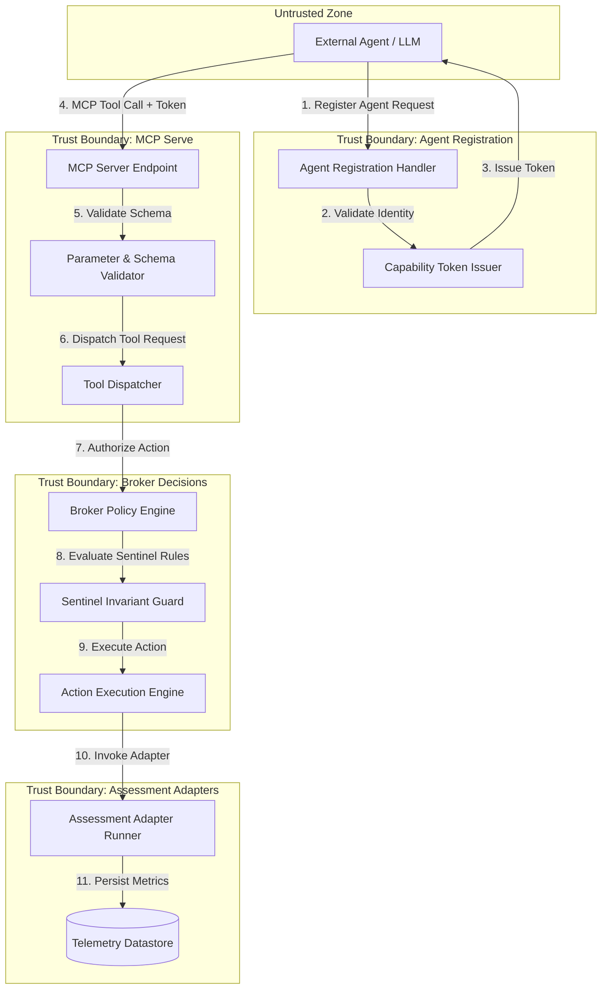

# Architecture Mapper Reference & Checklist

## Objective

The `architecture-mapper` agent inspects system schemas (`*.lds`), ontologies (`*.ttl`), configuration manifests (`.etg/entigram.yaml`), and codebase implementation files to construct a complete Data Flow Diagram (DFD) rendered in Mermaid syntax.

---

## Target Scope & Files

- **Schemas:** Logical Schema Definition files (`*.lds`)
- **Ontologies:** Turtle/OWL ontology files (`*.ttl`)
- **Configuration:** `.etg/entigram.yaml`, `entigram.yaml`, component manifests
- **Codebase:** Implementation modules in `src/`, `lib/`, `pkg/`, `cmd/` pertaining to:
  - Broker decisions engine
  - Agent registration handlers
  - Model Context Protocol (MCP) serve handlers
  - Assessment adapter runners

---

## Data Flow Diagram (DFD) Elements

When mapping the architecture, classify every element into one of the standard DFD categories:

1. **External Entities (EE):** External agents, third-party LLMs, external adapter environments, human operators.
2. **Processes (P):** Execution components (Broker Decision Engine, Registration Auth Handler, MCP Tool Dispatcher, Assessment Adapter Runner, Sentinel Guard).
3. **Data Stores (DS):** Local storage, policy repositories, schema catalogs, telemetry databases, session caches.
4. **Data Flows (DF):** Requests, responses, tool calls, policy evaluations, registration payloads, assessment metrics.
5. **Trust Boundaries (TB):** Perimeters separating zones of differing trust levels.

---

## Key Entigram Trust Boundaries to Map

### 1. Broker Decision Boundary
- **From:** Untrusted caller / incoming action request
- **To:** Authorized execution engine / protected system resources
- **Components:** Policy evaluator, capability verifier, decision logger

### 2. Agent Registration Boundary
- **From:** Unauthenticated incoming agent
- **To:** Registered agent pool / session state store
- **Components:** Handshake handler, identity cert verifier, capability token issuer

### 3. MCP Serve Boundary
- **From:** LLM / external agent runner
- **To:** Internal tool execution handlers
- **Components:** MCP server endpoint, schema parameter validator, context injection guard

### 4. Assessment Adapter Boundary
- **From:** Test runner / external adapter plugin
- **To:** Core evaluation engine & telemetry datastore
- **Components:** Adapter sandbox wrapper, telemetry sanitizer, metric recorder

---

## Mermaid DFD Output Format

The agent must output a valid Mermaid `graph TD` diagram illustrating all components and trust boundaries, formatted like:

---

## Analysis Checklist

- [ ] Identified all external entities connecting to Entigram services
- [ ] Cataloged all processes handling data at trust boundary crossings
- [ ] Mapped all data stores holding policy, registration, or telemetry data
- [ ] Verified representation of all 4 core trust boundaries (Broker, Registration, MCP, Adapters)
- [ ] Validated syntactical correctness of generated Mermaid DFD syntax
